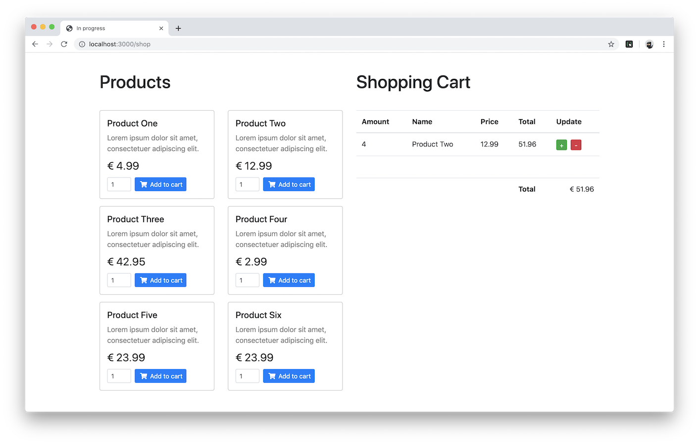

# A React Shopping Cart Demo

This is a small demo to show how the State can be used in React (**without Redux**) to create a shopping cart.

## Tech stack

- React  
  _Components, Props & States, Lifecycle methods_
- React Router  
  _Simple routes and NotFound_
- Helper functions
- Bootstrap
- FontAwesome
- Data persistence (localStorage)

## Online Demo

[Check the demo](https://simple-react-shop.m4r28.now.sh/)

## Preview

